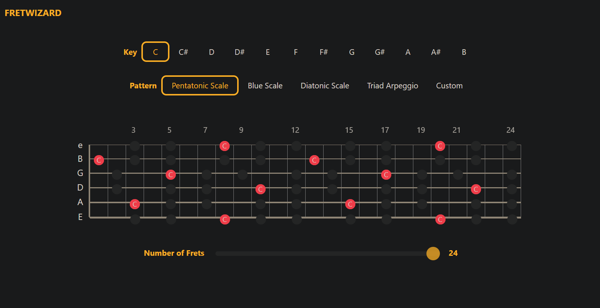
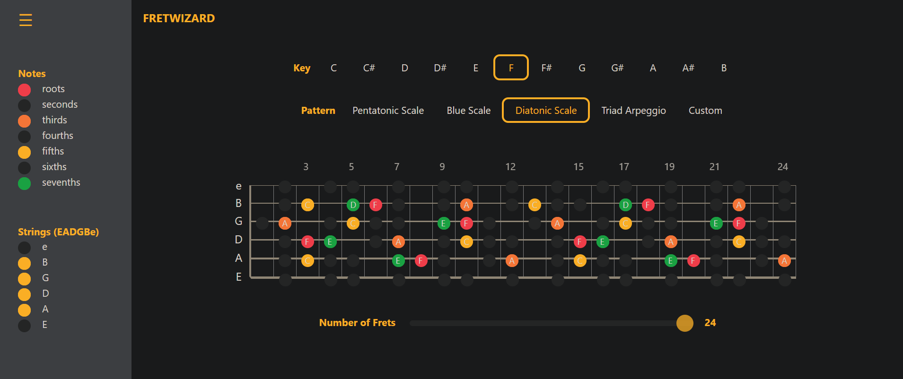

# FRETWIZARD

Fretwizard is a web-based guitar visualization tool built with Vue.js framework. 

<!-- TABLE OF CONTENTS -->
<details>
  <summary>Table of Contents</summary>
  <ol>
    <li><a href="#about-the-project">About the Project</a></li>
    <li><a href="#built-with">Tools and Frameworks</a></li>
    <li>
      <a href="#getting-started">Getting Started</a>
      <ul>
        <li><a href="#prerequisites">Prerequisites</a></li>
        <li><a href="#installation">Installation</a></li>
      </ul>
    </li>
    <li><a href="#roadmap">Roadmap</a></li>
    <li><a href="#contributing">Contributing</a></li>
    <li><a href="#license">License</a></li>
  </ol>
</details>

<!-- ABOUT THE PROJECT -->
## About The Project

FretWizard provides interactive fretboard diagrams to visualize scales, chords, and patterns across the guitar neck. It can be used to transpose to different keys and explore music theory concepts directly on their browser.

Open fretwizard on the browser.



Customize the fretboard based on what you need to practice.



View Demo - https://devjhom.github.io/fret-wizard/

<p align="right">(<a href="#readme-top">back to top</a>)</p>

## Tools and Frameworks

The main technologies used in this project:

[![Vue][Vue.js]][Vue-url]
[![Vite][Vite]][Vite-url]
[![Typescript][Typescript]][Typescript-url]
[![Bootstrap][Bootstrap.com]][Bootstrap-url]

<p align="right">(<a href="#readme-top">back to top</a>)</p>

<!-- GETTING STARTED -->
## Getting Started

### Prerequisites

This project requires NPM to be installed on your system.

* npm

  ```sh
  npm install npm@latest -g
  ```

### Installation

1. Clone the repo

   ```sh
   git clone https://github.com/github_username/repo_name.git
   ```
2. Install required packages

   ```sh
   npm install
   ```
2. Run Development Server

   ```sh
   npm run dev
   ```

<p align="right">(<a href="#readme-top">back to top</a>)</p>

<!-- ROADMAP -->
## Roadmap

This is a personal project that I'm building as a learning experience and for my own use. Development will be ongoing, and more features will be added over time as I have the opportunity. The current roadmap includes:

- [x] Major Scales
- [x] Transpose to different keys
- [ ] Minor Scales
- [ ] Chords
- [ ] The CAGED System
- [ ] Custom features

See the [open issues](https://github.com/DevJhom/fret-wizard/issues) for a full list of proposed features (and known issues).

<p align="right">(<a href="#readme-top">back to top</a>)</p>

<!-- CONTRIBUTING -->
## Contributing

If you have a suggestion that would make this project better, please fork the repo and create a pull request. You can also simply open an issue with the tag "enhancement". If you like this project, don't forget to give it a star! Thanks again!

1. Fork the Project
2. Create your Feature Branch (`git checkout -b feature/AmazingFeature`)
3. Commit your Changes (`git commit -m 'Add some AmazingFeature'`)
4. Push to the Branch (`git push origin feature/AmazingFeature`)
5. Open a Pull Request

<p align="right">(<a href="#readme-top">back to top</a>)</p>

<!-- LICENSE -->
## License

Distributed under the Unlicense License. See `LICENSE.txt` for more information.

<p align="right">(<a href="#readme-top">back to top</a>)</p>

<!-- MARKDOWN LINKS & IMAGES -->
[product-screenshot]: images/screenshot.png

[Vue.js]: https://img.shields.io/badge/Vue.js-35495E?style=for-the-badge&logo=vuedotjs&logoColor=4FC08D
[Vue-url]: https://vuejs.org/
[Typescript]: https://img.shields.io/badge/TypeScript-007ACC?style=for-the-badge&logo=typescript&logoColor=white
[Typescript-url]: https://www.typescriptlang.org/
[Vite]: https://img.shields.io/badge/Vite-B73BFE?style=for-the-badge&logo=vite&logoColor=FFD62E
[Vite-url]: https://vite.dev/
[Bootstrap.com]: https://img.shields.io/badge/Bootstrap-563D7C?style=for-the-badge&logo=bootstrap&logoColor=white
[Bootstrap-url]: https://getbootstrap.com
